# MyAnimeList

Android application built on public api designed to help users explore and discover information
about anime series, movies, characters, and related content. It provides a user-friendly interface
where anime enthusiasts can search for specific anime titles, browse through a vast collection of
anime, and access detailed information about each entry.

## Screenshots

|  |  |  |
|---------------------------------------------------------------|---------------------------------------------------------------|---------------------------------------------------------------|
|  |  |  |

## Modules

```mermaid
flowchart TD
    app
    subgraph core
        core:enums(enums)
        core:mvi(mvi)
        core:navigator(navigator)
        core:ui(ui)
        core:utils(utils)
    end
    subgraph data
        data:common(common)
        data:datastore(datastore)
        data:ktor(ktor)
        data:multiaccounts(multiaccounts)
        data:user(user)
    end
    subgraph feature
        subgraph feature:data [data]
            feature:data:anime(anime)
        end
        subgraph feature:domain [domain]
            feature:domain:anime(anime)
            feature:domain:auth(auth)
            feature:domain:core(core)
            feature:domain:manga(manga)
            feature:domain:models(models)
            feature:domain:user(user)
        end
        feature:navigator(navigator)
        subgraph feature:settings [settings]
            feature:settings:core(core)
            feature:settings:data(data)
            feature:settings:domain(domain)
            feature:settings:navigator(navigator)
            feature:settings:ui(ui)
        end
        subgraph feature:theme [theme]
            feature:theme:ui(ui)
        end
        subgraph feature:ui [ui]
            feature:ui:anime(anime)
            feature:ui:models(models)
            feature:ui:user(user)
        end
    end

    core:mvi --> app
    feature:ui:anime --> app
    feature:settings:ui --> app
    feature:theme:ui --> app
    feature:ui:user --> app
    feature:navigator --> app
    core:navigator --> app
    core:ui --> app
    feature:domain:auth --> app
    data:multiaccounts --> data:common
    core:enums --> data:common
    data:ktor --> data:common
    data:ktor --> data:multiaccounts
    core:utils --> data:multiaccounts
    data:common --> data:user
    data:ktor --> data:user
    data:multiaccounts --> data:user
    data:multiaccounts --> feature:data:anime
    data:ktor --> feature:data:anime
    core:enums --> feature:data:anime
    data:common --> feature:data:anime
    feature:data:anime --> feature:domain:anime
    data:common --> feature:domain:anime
    core:enums --> feature:domain:anime
    feature:domain:core --> feature:domain:anime
    core:utils --> feature:domain:anime
    core:utils --> feature:domain:auth
    data:multiaccounts --> feature:domain:auth
    data:user --> feature:domain:auth
    data:ktor --> feature:domain:auth
    feature:domain:models --> feature:domain:auth
    core:enums --> feature:domain:core
    data:common --> feature:domain:core
    core:utils --> feature:domain:core
    feature:domain:core --> feature:domain:manga
    data:common --> feature:domain:manga
    core:enums --> feature:domain:manga
    feature:domain:core --> feature:domain:manga
    core:utils --> feature:domain:manga
    data:user --> feature:domain:models
    data:multiaccounts --> feature:domain:models
    data:common --> feature:domain:user
    data:user --> feature:domain:user
    feature:domain:models --> feature:domain:user
    core:enums --> feature:domain:user
    feature:domain:core --> feature:domain:user
    core:enums --> feature:navigator
    data:datastore --> feature:settings:data
    feature:settings:core --> feature:settings:data
    feature:settings:data --> feature:settings:domain
    feature:settings:core --> feature:settings:domain
    core:mvi --> feature:settings:ui
    feature:settings:core --> feature:settings:ui
    core:ui --> feature:settings:ui
    feature:ui:user --> feature:settings:ui
    feature:ui:models --> feature:settings:ui
    core:navigator --> feature:settings:ui
    feature:settings:navigator --> feature:settings:ui
    feature:navigator --> feature:settings:ui
    feature:settings:domain --> feature:settings:ui
    feature:domain:auth --> feature:settings:ui
    feature:domain:user --> feature:settings:ui
    feature:domain:models --> feature:settings:ui
    feature:settings:domain --> feature:theme:ui
    feature:settings:core --> feature:theme:ui
    core:mvi --> feature:ui:anime
    feature:ui:user --> feature:ui:anime
    core:navigator --> feature:ui:anime
    feature:settings:navigator --> feature:ui:anime
    feature:navigator --> feature:ui:anime
    feature:domain:anime --> feature:ui:anime
    feature:domain:manga --> feature:ui:anime
    feature:domain:core --> feature:ui:anime
    feature:domain:auth --> feature:ui:anime
    core:ui --> feature:ui:anime
    core:enums --> feature:ui:anime
    core:utils --> feature:ui:anime
    feature:domain:models --> feature:ui:models
    core:navigator --> feature:ui:user
    feature:navigator --> feature:ui:user
    core:mvi --> feature:ui:user
    feature:domain:user --> feature:ui:user
    feature:domain:auth --> feature:ui:user
    core:ui --> feature:ui:user
    feature:ui:models --> feature:ui:user
```



## Configuration

### Keystores and privacy policy:

Create `local.properties` with the following info:

```properties
# keystore file path
store.file=...
# keystore password
store.password=...
# key alias
key.alias=...
# key password
key.password=...
# api key from https://myanimelist.net/apiconfig
api.key=...
# url link to privacy policy
privacy.link=...
```

And place keystore under `store.file` directory.

## Links

[](https://github.com/VladDaniliuk)
[](https://t.me/vladdaniliuk)
[](https://www.linkedin.com/in/vladislavdaniliuk/)
